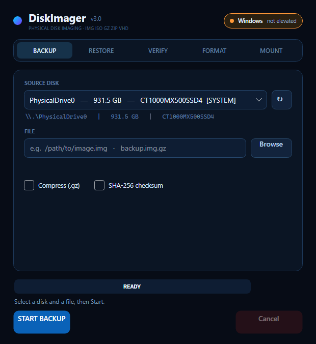
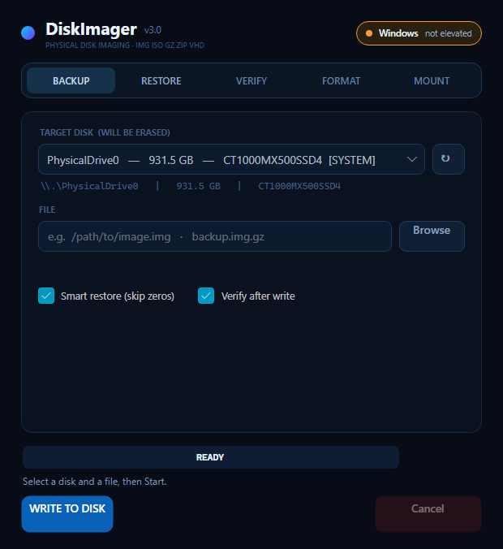
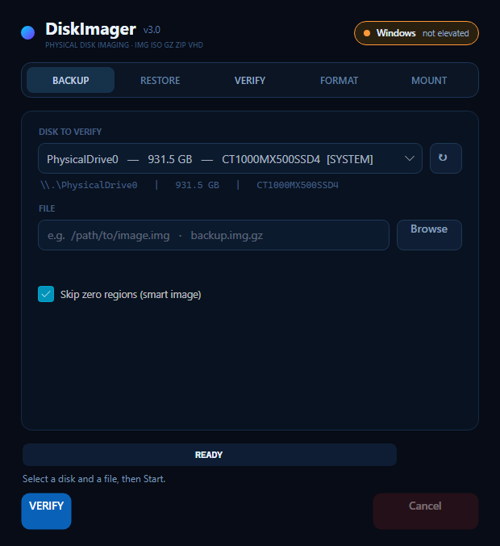
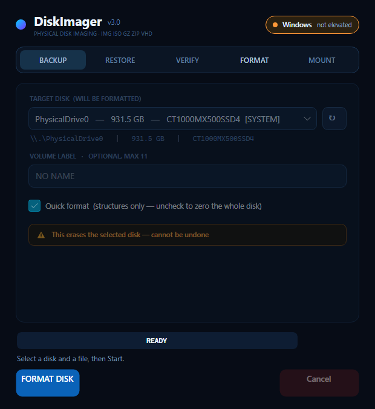
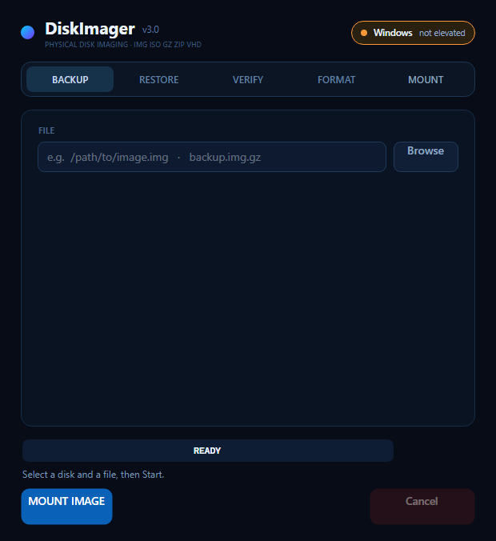

# DiskImager v3 — Cross-Platform

Standalone disk imaging utility for **Windows, macOS, and Linux**.  
Backup · Restore · Verify · FAT32 Format · Mount — no installer, single executable.



---

## Modes

<table>
<tr>
<td><br><b>Backup</b> — raw or gzip image + SHA-256</td>
<td><br><b>Restore</b> — smart (skip zeros) + verify after</td>
</tr>
<tr>
<td><br><b>Verify</b> — byte-for-byte compare</td>
<td><br><b>Format</b> — FAT32, quick or full zero</td>
</tr>
<tr>
<td><br><b>Mount</b> — attach image as virtual disk</td>
<td></td>
</tr>
</table>

---

## Download

Pre-built single-file binaries — no runtime, no installer:

| Platform | Binary |
|----------|--------|
| Windows x64 | `DiskImager-windows-x64.exe` — right-click → **Run as administrator** |
| macOS Apple Silicon | `DiskImager-macos-arm64` — `chmod +x` then `sudo ./…` |
| macOS Intel | `DiskImager-macos-x64` — `chmod +x` then `sudo ./…` |
| Linux x64 | `DiskImager-linux-x64` — `chmod +x` then `sudo ./…` |

All binaries + `SHA256SUMS.txt` are on the [Releases](../../releases) page.

> **macOS:** unsigned binary — first launch: right-click → Open → Open.

---

## Supported image formats

Raw `.img` / `.bin` · ISO 9660 · GZip `.gz` · ZIP (stored/deflate) · VHD (fixed)

---

## Safety

The OS disk is detected, tagged **[SYSTEM]**, and cannot be erased without typing **ERASE** in a confirmation dialog. Every destructive operation shows the exact device path and size before proceeding.

---

## Build from source

Requires [.NET 7 SDK](https://dotnet.microsoft.com/download/dotnet/7.0).

```bash
# run directly
dotnet run --project src/DiskImager.App

# diagnostics
dotnet run --project src/DiskImager.App -- --list       # print detected disks
dotnet run --project src/DiskImager.App -- --selftest   # 39 engine unit tests

# single-file self-contained binary
dotnet publish src/DiskImager.App -c Release -r linux-x64 --self-contained true \
  -p:PublishSingleFile=true -p:IncludeNativeLibrariesForSelfExtract=true \
  -p:EnableCompressionInSingleFile=true -o out/
```

Supported RIDs: `win-x64` · `linux-x64` · `osx-x64` · `osx-arm64`  
Pushing a `v*` tag builds all four via GitHub Actions and attaches them to the release.

---

## Architecture

```
src/DiskImager.App/
  Engine/
    Imaging.cs        — backup / restore / verify (OS-independent)
    Fat32.cs          — FAT32 format engine (pure functions, fully tested)
    ImageSource.cs    — raw / gz / zip / vhd streaming
  Disk/
    IDiskBackend.cs   — platform interface
    WindowsBackend.cs — WMI enum + \\.\PhysicalDriveN I/O
    MacBackend.cs     — diskutil + /dev/rdiskN + hdiutil
    LinuxBackend.cs   — lsblk + /dev/sdX + udisksctl
  ViewModels/
    MainViewModel.cs  — MVVM (CommunityToolkit.Mvvm)
  MainWindow.axaml    — Avalonia 11 Fluent UI
```

OS backend selected at runtime via `BackendFactory.Create()` — one codebase, native I/O per platform.

---

## License

MIT
