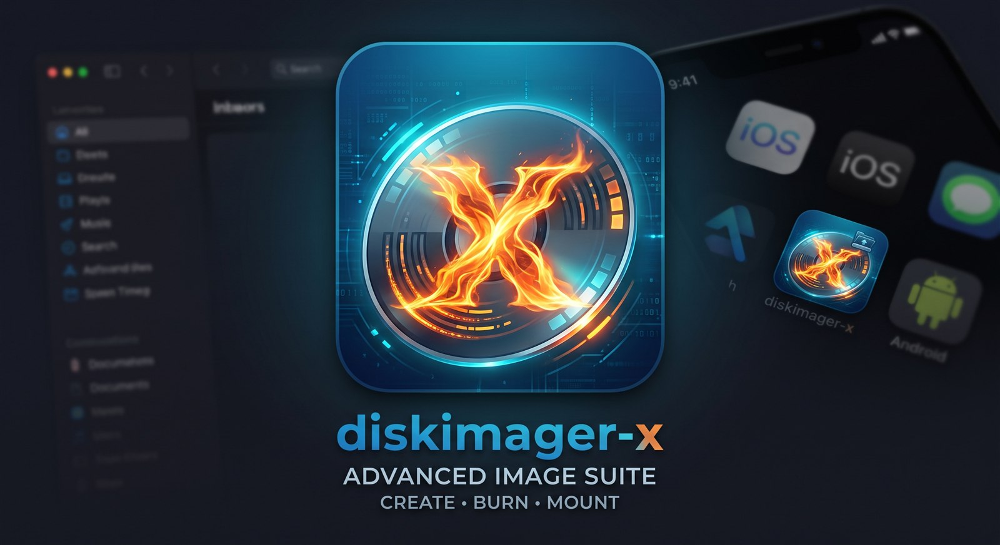

  

# DiskImager-X — Advanced Image Suite

Standalone disk imaging utility for **Windows, macOS, and Linux**.  
Backup · Restore · Verify · FAT32 Format · Mount — no installer, single executable.

---

## Download

Pre-built single-file binaries — no runtime, no installer:

| Platform | Binary |
|----------|--------|
| Windows x64 | `DiskImager-windows-x64.exe` — right-click → **Run as administrator** |
| macOS Apple Silicon | `DiskImager-macos-arm64` — `chmod +x` then `sudo ./…` |
| macOS Intel | `DiskImager-macos-x64` — `chmod +x` then `sudo ./…` |
| Linux x64 | `DiskImager-linux-x64` — `chmod +x` then `sudo ./…` |

All binaries + `SHA256SUMS.txt` are on the [Releases](../../releases) page.

> **macOS:** unsigned binary — first launch: right-click → Open → Open.

---

## Modes

<table>
<tr>
<td> <b>Backup</b> — raw or gzip image + SHA-256</td>
<td> <b>Restore</b> — smart (skip zeros) + verify after</td>
</tr>
<tr>
<td> <b>Verify</b> — byte-for-byte compare</td>
<td> <b>Format</b> — FAT32, quick or full zero</td>
</tr>
<tr>
<td> <b>Mount</b> — attach image as virtual disk</td>
<td></td>
</tr>
</table>

---

## Fast

- **Parallel gzip backups** — compression fans out across all CPU cores; compressed backups run at disk speed, not CPU speed
- **Pipelined I/O** — reads and writes overlap in every mode
- **Smart restore** — zero regions are skipped instead of written
- Progress is honest: on every OS the device's write cache is flushed **before** "Done" is reported

---

## Supported image formats

Raw `.img` / `.bin` · ISO 9660 · GZip `.gz` · ZIP (stored/deflate) · VHD (fixed)

---

## Safety

The OS disk is detected, tagged **[SYSTEM]**, and cannot be erased without typing **ERASE** in a confirmation dialog. Every destructive operation shows the exact device path and size before proceeding.

---

## License

MIT
